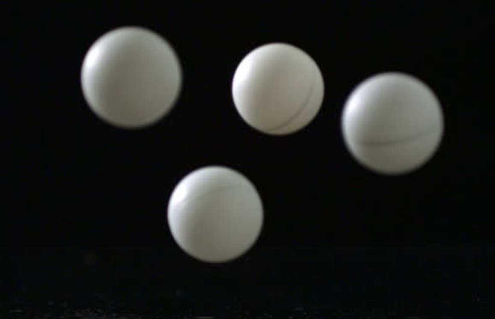
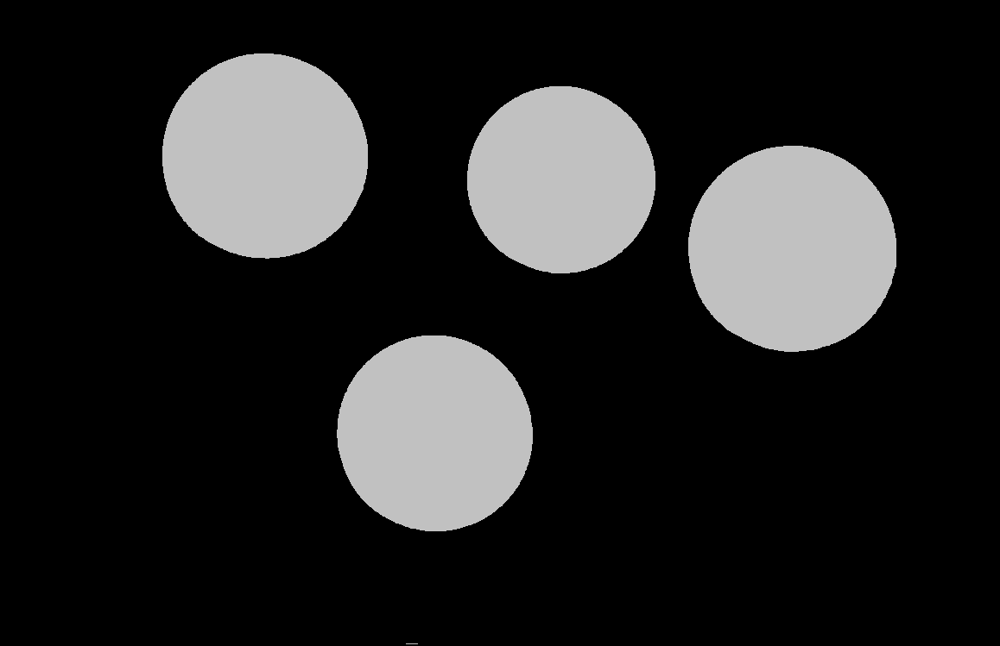
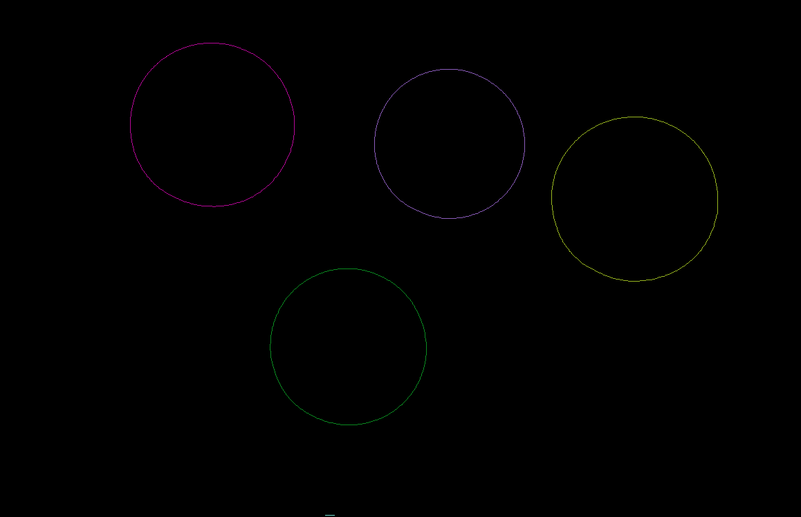
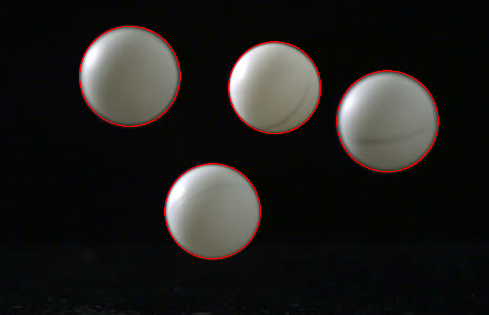

# Лабораторна робота №10. Розпізнавання об’єктів шляхом аналізу габаритних прямокутників
### Мета роботи
Навчитись розпізнавати об’єкти шляхом аналізу габаритних прямокутників.
### Теоретичні відомості
Розпізнавання об'єктів однакової характеристики (наприклад м'я для пінгпонгу) можна за допомогою аналізу габаритних прямокутників. Суть даного методу полягає в тому, що зображення розподіляється на зв'язні області за допомогою заливкі. Кожна область вписується у габаритний квадрат, потім на основі його розміру визначається, чи даній області відповідає шуканий предмет.
### Код програми з поясненнями
В даній роботі я знаходив м'ячі для пінгпонгу. Я модернізував алгоритм габаритних прямокутників шляхом попередніх маніпуляцій із зображенням та використанням контурів замість заливки.



Спочатку переводимо зображення до `COLOR_RGBA2GRAY` та використовуємо метод `threshold` для виділення областей наших ймовірних м'ячів відповідно до яскравості
```javascript
cv.cvtColor(src, filled, cv.COLOR_RGBA2GRAY, 0);
cv.threshold(filled, filled, 50, 200, cv.THRESH_BINARY);
```


Потім за допомогою методу `findContours` знаходимо усі контури на зображені
```javascript
cv.findContours(filled, contours, hierarchy, cv.RETR_CCOMP, cv.CHAIN_APPROX_SIMPLE);
```


Для кожного контуру будуємо габаритний прямокутник за допомогою методу `boundingRect`
```javascript
const rect = cv.boundingRect(contours.get(i));
```


Якщо прямокутник лежить в межах `minRectDim` та `maxRectDim` - значить це наш м'яч. Малюємо навколо нього круг з розміром як наший прямокутник для візуального результату
```javascript
if (rect.width >= minRectDim && rect.width <= maxRectDim
 && rect.height >= minRectDim && rect.height <= maxRectDim) {
 const x = rect.x + rect.width / 2;
 const y = rect.y + rect.height / 2;
 const rad = Math.max(rect.width, rect.height) / 2;
 cv.circle(dst, {x, y}, rad, [255, 0, 0, 255], 2);
}
```

### Висновки
Отже, на даній лабораторній роботі ми навчилися розпізнавати об'єкти на зображені за допомогою методу габаритних прямокутників. Також ми розглянули проблеми, які з'являються при використані даного методу та способи їх можливого вирішення за допогомю попередніх маніпуляцій над вихідним зображенням. 
