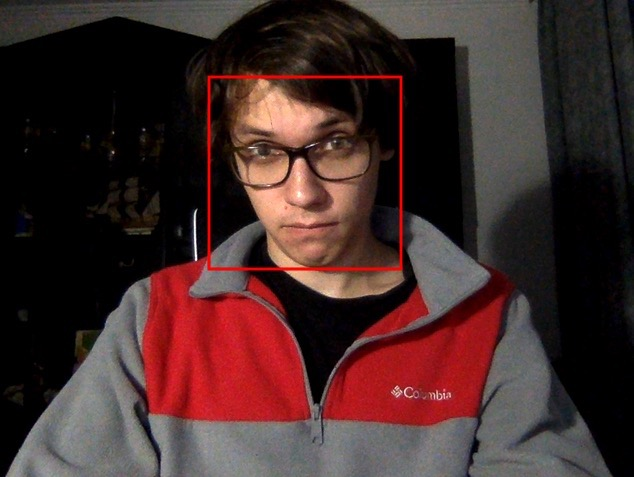

# Лабораторна робота №13. Розпізнавання обличчя
### Мета роботи
Навчитись реалізовувати найпростіші системи розпізнавання облич.

### Теоретичні відомості
Для розпізнавання різного роду об’єктів бібліотека OpenCV використовує метод П.Віоли і М.Джонса, який був опублікований в 2001 році. Також даний метод називають методом Віоли-Джонса (або навіть просто Віолою-Джонсом). Цей підхід до класифікації об'єктів на зображенні комбінує чотири ключові концепції:
* Прості прямокутні функції (функції Хаара).
* Інтегральне представлення зображення.
* Метод машинного навчання AdaBoost.
* Каскадний класифікатор.

Одним з недоліків каскадної класифікації є її повільна робота. Тому часто каскадну класифікацію поєднують з іншими методами розпізнавання образів. Наприклад, людину на зображенні можна також розпізнати за кольором шкіри. Для цього над зображенням проводять декілька операцій:
* Конвертація зображення з RGB формату в HSV (Hue, Saturation, Value — тон, насиченість, значення).
* Порогова обробка для можливого діапазону кольорів шкіри. Ті пікселі зображення, що відповідають шкірі стануть білого кольору, всі інші – чорного.

Для виконання трекінгу обличчя у відео потоці поєднаємо каскадну класифікацією Хаара для визначення обличчя та алгоритмом визначення шкіри на зображенні. Нагадаємо, що перший метод є надійний при визначенні обличчя, проте «дорогий» в плані системних ресурсів і відповідно неприйнятний для швидкого трекінгу.
### Код програми з поясненнями

При виконанні даної роботи в мене виникли проблеми із завантаженням об'єкту для визначення лиць за допомогою методу ```faceClassifier.load('haarcascade_frontalface_default.xml');```. Я знайшов спосіб, як це зробити, проте він не працює у випадку локального html файлу, що я використовую.
Саме тому я виконав цю лабораторну роботу на платформі 
[codepen](https://codepen.io/pelykh/pen/ExxgXLm).


Спочатку створюємо `faceClassifier`, який буде відповідати за пошук лиць на зображенні за допомогою попередньо натренованого алгоритму.
```javascript
faceClassifier = new cv.CascadeClassifier();
faceClassifier.load('haarcascade_frontalface_default.xml');
```
Метод `faceClassifier.detectMultiScale` виконує пошук лиць, при цьому йому потрібно передати два аргументи, `faceMat` містить попередньо оброблене зображення з відеопотоку, а `faceVect` результат обчислень.
```javascript
let faces = [];
let size;
let faceVect = new cv.RectVector();
let faceMat = new cv.Mat();
cv.pyrDown(grayMat, faceMat);
cv.pyrDown(faceMat, faceMat);
size = faceMat.size();
    
faceClassifier.detectMultiScale(faceMat, faceVect);
```

Ось як виглядає результат

### Висновки
Отже, на даній лабораторній роботі ми навчилися використовувати засоби opencv для пошуку лиць у відеопотоці.
