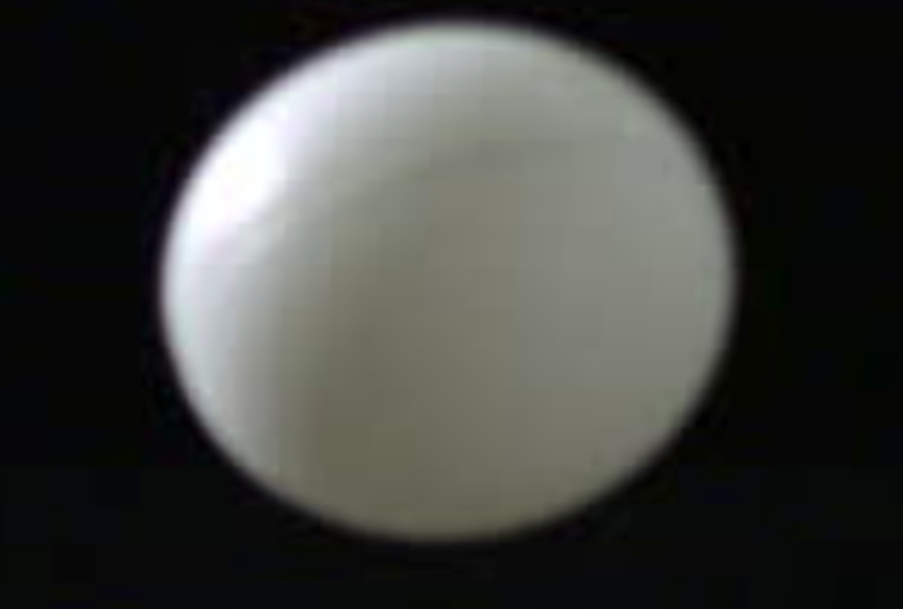
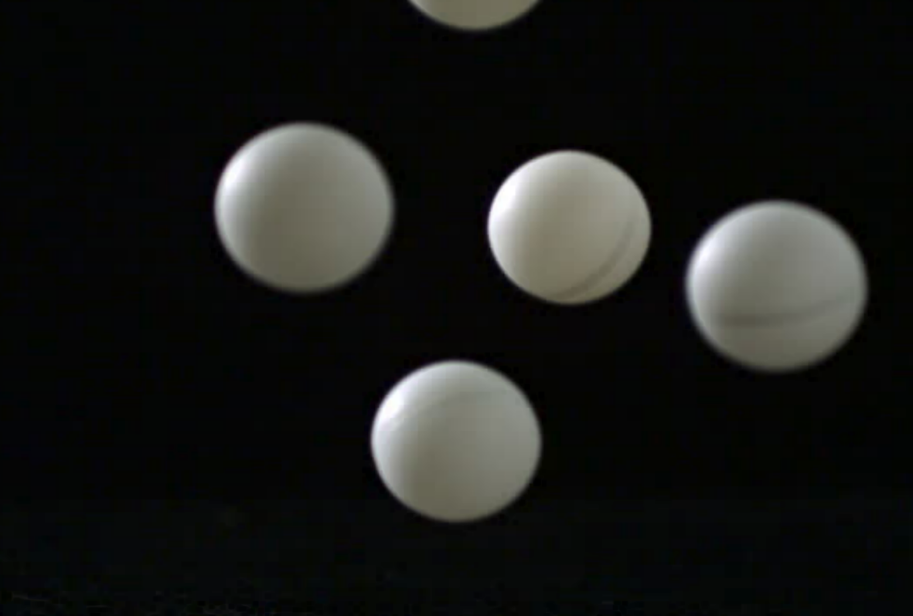
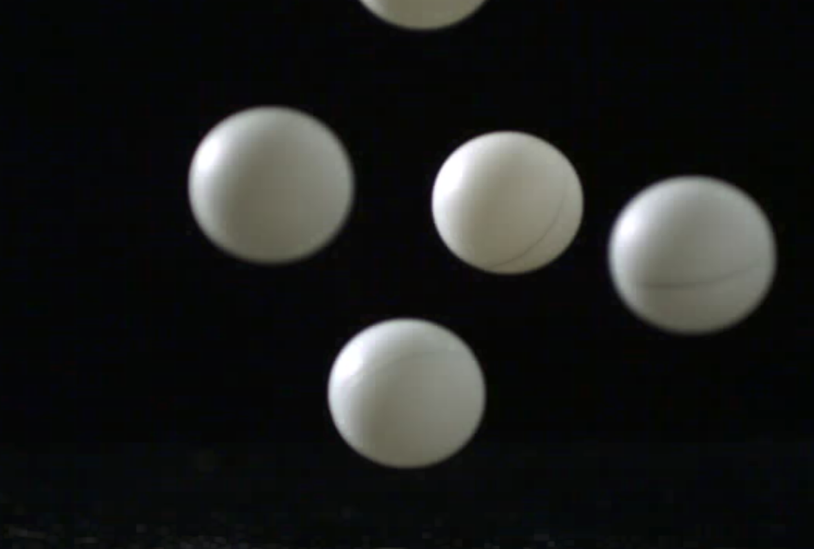
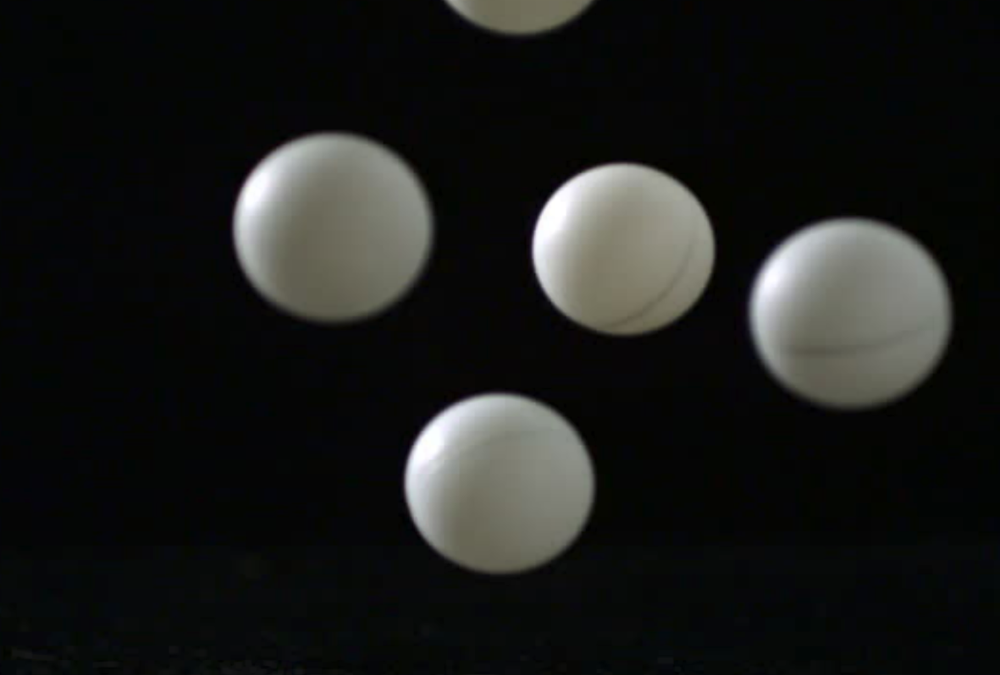
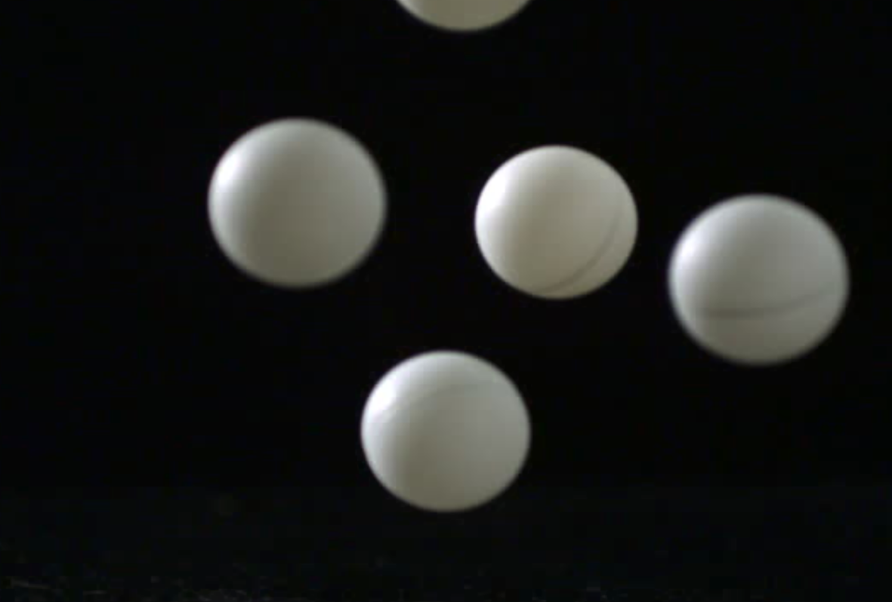
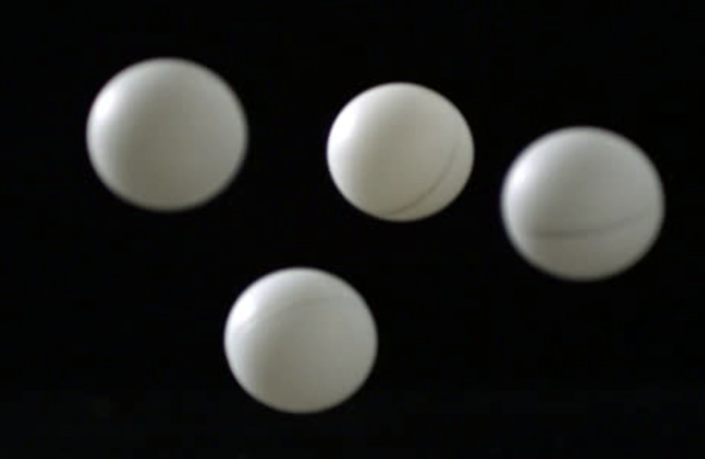
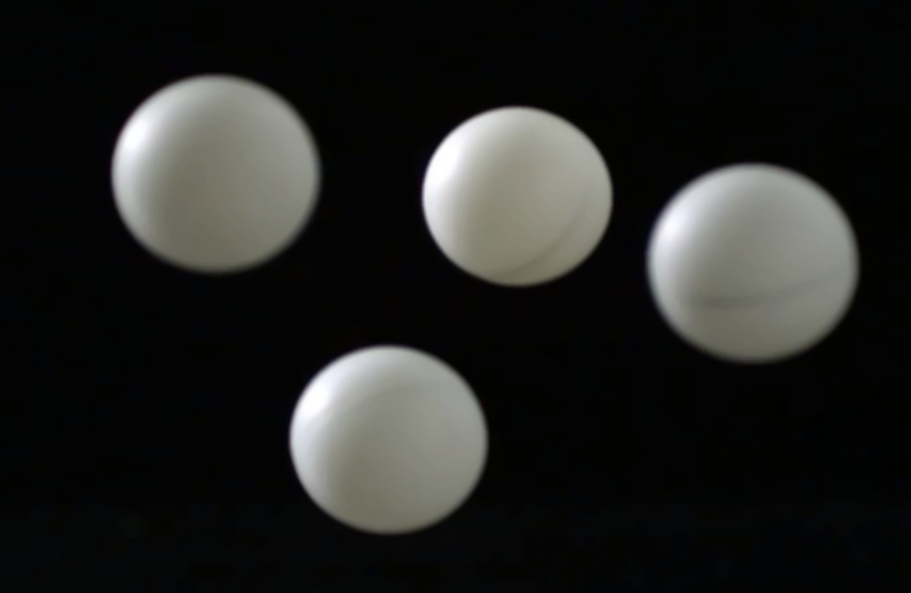
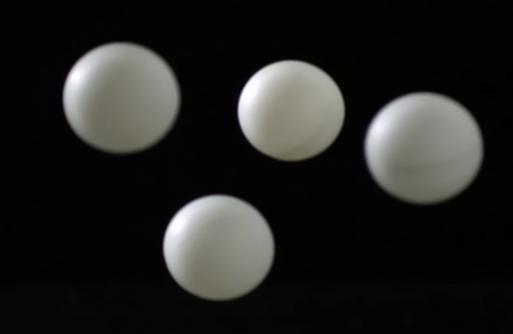

# Лабораторна робота №9. Обробка зображення
### Мета роботи
Навчитися виконувати геометричне вирівнювання; морфологічні операції ерозії, дилатації, відкриття, замикання та застосовувати фільтри згладжування.

### Теоретичні відомості
Іноді  необхідно вирівняти зображення, для цього використовують два види перетворення - перспективне та білінійне. 

### Код програми з поясненнями
Персективне перетворення відбувається за допомогою методу `warpPerspective`, проте перед тим необхідно визначити матрицю перетворення `M` за допомогою методу `getPerspectiveTransform`.
```javascript
const M = cv.getPerspectiveTransform(srcCoords, finalDestCoords);
cv.warpPerspective(src, dst, M, dsize, cv.INTER_LINEAR, cv.BORDER_CONSTANT, new cv.Scalar());
```


Ерозія виконується за допомогою методу `erode`, проте попередньо задаємо `M`, у моєму випадку це матриця з одиниць.
```javascript
let M = cv.Mat.ones(5, 5, cv.CV_8U);
let anchor = new cv.Point(-1, -1);
cv.erode(src, dst, M, anchor, 1, cv.BORDER_CONSTANT, cv.morphologyDefaultBorderValue());
```


Аналогічно відбувається дилатація за домогою методу `dilate`.
```javascript
const M = cv.Mat.ones(5, 5, cv.CV_8U);
const anchor = new cv.Point(-1, -1);
cv.dilate(src, dst, M, anchor, 1, cv.BORDER_CONSTANT, cv.morphologyDefaultBorderValue());
```


Відкриття це послідовність операцій ерозія та дилатація, використовуємо метод `morphologyEx` з аргументом `cv.MORPH_OPEN`.
```javascript
let M = cv.Mat.ones(5, 5, cv.CV_8U);
let anchor = new cv.Point(-1, -1);
cv.morphologyEx(src, dst, cv.MORPH_OPEN, M, anchor, 1, cv.BORDER_CONSTANT, cv.morphologyDefaultBorderValue());
```


Pfrhbnnz це послідовність операцій дилатація та ерозія, використовуємо метод `morphologyEx` з аргументом `cv.MORPH_CLOSE`.
```javascript
let M = cv.Mat.ones(5, 5, cv.CV_8U);
let anchor = new cv.Point(-1, -1);
cv.morphologyEx(src, dst, cv.MORPH_CLOSE, M, anchor, 1, cv.BORDER_CONSTANT, cv.morphologyDefaultBorderValue());
```


Медіане розмиття відбувається за домопогою методу `medianBlur`, нам потрібно лише задати ядро (має обов'язково бути непарним числом).
```javascript
cv.medianBlur(src, dst, power);
```
Ось кадри зі створеного відео послідовного розмиття зображення.



### Висновки
Отже, на даній лабораторній роботі ми навчилися виконувати геометричне вирівнювання, морфологічні операції ерозії, дилатації, відкриття, замикання та застосовувати фільтри згладжування.
